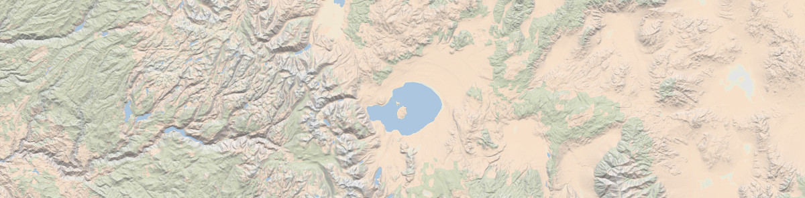

# Introduction

The [California Forest Observatory][cfo-web] (CFO) is a data-driven forest monitoring system that maps the drivers of wildfire behavior across the state—including vegetation fuels, weather, topography & infrastructure—from space.

The `cfo` library was designed to provide easy access to CFO datasets. Each dataset has a unique `asset_id`, and the `search` and `fetch` workflows were designed to query and download these assets. 

- You can search for asset IDs by geography, data type, and time of year
  - `forest.search(geography="SantaCruzCounty", metric="CanopyHeight", year=2020)`
- You can download the data to your loacal machine
  - `forest.download(asset_id, output_file)`
- If you don't want the file, you can just fetch the download URL
  - `forest.fetch(asset_id, dl=True)` 
- Or a WMS URL for web mapping 
  - `forest.fetch(asset_id, wms=True)`

You can find support for the CFO API at the [community forum][cfo-forum].

## License

CFO data are available for free for non-commercial use per the [API terms][api-terms]. You must have a CFO account, which you can create by visiting [the web map][cfo-web], clicking the menu in the top right corner and selecting "Create an account." Please keep track of the e-mail address and password you used to create your Forest Observatory account, as you'll need them to authenticate API access.

The software provided here, the `cfo` python API wrapper, is provided with an MIT license. Please do not confuse the license terms for the wrapper with the [terms of use][api-terms] for the API.

## Table of contents

- [Installation](#installation)
- [Authentication](#authentication)
- [Searching for data](#searching)
- [Downloading data](#downloads)
- [Serving map tiles](#map-tiles)
- [Contact](#contact)

# Installation

This library can be installed via `pip` directly from Github.

```bash
pip install cfo
```

If you don't have `pip` you could also clone the repository locally and install using python's `setuptools`

```bash
git clone https://github.com/forestobservatory/cfo-api.git
cd cfo-api
python setup.py install
```

Once installed, you should be able to load the `cfo` module in python. Instatiate the `api` class to begin working with the Forest Observatory API.

```python
import cfo
forest = cfo.api()
```


# Authentication

A Forest Observatory account is required to use the API (sign up free at [forestobservatory.com][cfo-web]).

There are two authentication methods: entering your CFO account's email/password at runtime or setting environment variables.

### Passing your credentials at runtime

Using any API call (`forest.search()`, `forest.fetch()`, `forest.download()`) will prompt you to enter the following authentication information:

```python
>>> CFO E-mail: slug@forest.net
>>> CFO Password: **********
```

You can also authenticate directly with `forest.authenticate()`.

This retrieves an authentication token from the API, which is stored as a temp file for future access (this does not store your e-mail/password). The API reads this stored token, which means you won't have to pass your email/password during each session.

### Setting environment variables 

You can forego runtime credential entry by setting environment variables. This is the lowest friction, least secure approach. You'll set the following variables in your `.bashrc` profile or elsewhere.

```bash
export CFO_EMAIL=slug@forest.net
export CFO_PASS=ari0limax
```

### Restoring a botched authentication

The temp file that stores your authentication credentials can sometimes get donked up. To re-authenticate, use the following command to pass your credentials and overwrite the temporary token data.

```python
forest.authenticate(ignore_temp=True)
```


# Searching

CFO data are organized by `asset_id`. These IDs contain information on the spatial extent of the data, the category and name of the data, the time of collection, and the spatial resolution. Asset IDs follow this naming format:

```python
asset_id = {geography}-{category}-{metric}-{year}-{timeOfYear}-{resolution}
```

Some examples:

- A statewide vegetation fuels dateset that's rendered in the Layers tab: `California-Vegetation-CanopyHeight-2020-Summer-00010m`.
- A statewide weather dataset queried in the Trends tab: `California-Weather-WindSpeed-2020-0601-03000m`.
- A county-level dataset accessed in the Download tab: `Marin-Vegetation-SurfaceFuels-2020-Spring-00010m`.

The `forest.search()` function queries the API and returns the assets that match the search terms.

```python
>>> import cfo
>>> forest = cfo.api()
>>> forest.search(geography="MendocinoCounty", metric="CanopyCover")
2020-09-07 13:53:47,028 INFO cfo.utils [authenticate] Loaded cfo token
['MendocinoCounty-Vegetation-CanopyCover-2020-Fall-00010m']
```

The default behavior of this function is to return the asset IDs as a list.

You could instead return the API JSON data, including asset ID, the spatial extent (`bbox`) of the data, the catalog its stored in, etc. by setting `just_assets=False`.

```python
>>> forest.search(geography="MendocinoCounty", metric="CanopyCover", just_assets=False)
[{'asset_id': 'MendocinoCounty-Vegetation-CanopyCover-2020-Fall-00010m',
'attribute_dict': {},
'bbox': [-124.022978699284, -122.814767867036, 38.7548320538975, 40.0060478879686],
'catalog': 'cfo',
'description': 'CanopyCover',
'expiration_utc_datetime': '',
'utc_datetime': '2020-07-09 09:52:42.292286+00:00'}]
```

And to examine the full response from the `requests` library, use `forest.search(raw=True)`.

But with over 17,000 published assets it's not easy to know just what to search by. So we wrote some functions to simplify your searches.

### Convenience functions

Based on the asset ID naming convention above, we've provided some `list` functions as a guide to what's available.

- Geography - CFO datasets have been clipped to different spatial extents: statewide, by county, by municipality, by watershed.
  - `forest.list_geographies()` - returns the different geographic extents. Use `forest.list_geographies(by="County")` to narrow return just the unique counties.
  - `forest.list_geography_types()` - returns the categories of geographical clipping available.
- Category - we currently provide three categories of data.
  - `forest.list_categories()` - returns [`Vegetation`, `Weather`, `Wildfire`]
- Metric - each category of data contains a list of different available data types
  - `forest.list_metrics()` - returns the unique metrics for each category. 
  - Run `forest.list_metrics(category="Weather")` to return only weather-specific metrics.

Use these as keywords when searching for data (e.g. `id_list = forest.search(geography="FresnoCounty", category="Vegetation")`).

You can also use wildcards:

```python
>>> forest.search(geography='Plumas*', metric='CanopyHeight')
['PlumasCounty-Vegetation-CanopyHeight-2020-Fall-00010m',
'PlumasEurekaMunicipality-Vegetation-CanopyHeight-2020-Fall-00010m',
'PlumasLakeMunicipality-Vegetation-CanopyHeight-2020-Fall-00010m']
```

### A note on availabile datasets

Even though we have a range of geographic extents, resolutions, and metrics, it is **not** the case that we provide all permutations of extent/resolution/metric. For example, we clip all `Vegetation` data to the county level, but we do not clip any `Weather` data that fine. All weather data are only available at the state level. 

This means you don't really need to specify the geographic extent if you search for weather data. You'll get pretty far with `wind_ids = forest.search(metric="WindSpeed")`.


# Downloads

Once you've generated a list of asset IDs, you can then download the files to your local machine. The `forest.download()` function requires an asset_id string so you'll have to iterate over search results, which are often returned as lists.

Here's how to search for and download all data from Mendocino County.

```python
import cfo
forest = cfo.api()
asset_ids = forest.search(geography="MendocinoCounty")
for asset in asset_ids:
    forest.download(asset)
```

Which generates the following output as it downloads each file.

```
2020-09-07 16:19:24,542 INFO cfo.utils [download] Beginning download for: MendocinoCounty-Vegetation-CanopyHeight-2020-Fall-00010m
2020-09-07 16:19:28,853 INFO cfo.utils [download] Successfully downloaded MendocinoCounty-Vegetation-CanopyHeight-2020-Fall-00010m to file: /home/slug/MendocinoCounty-Vegetation-CanopyHeight-2020-Fall-00010m.tif
2020-09-07 16:19:29,359 INFO cfo.utils [download] Beginning download for: MendocinoCounty-Vegetation-CanopyBaseHeight-2020-Fall-00010m
2020-09-07 16:19:32,321 INFO cfo.utils [download] Successfully downloaded MendocinoCounty-Vegetation-CanopyBaseHeight-2020-Fall-00010m to file: /home/slug/MendocinoCounty-Vegetation-CanopyBaseHeight-2020-Fall-00010m.tif
...
```

This function uses the `fetch()` command under the hood to retrieve a URL for where the file is hosted on google cloud storage. It then performs a `GET` call to download the file locally. 

The function will download the file to your current working directory if you don't specify an output file path. You can set a custom output path with `forest.download(asset_id, path)`. This may be tricky if you're downloading multiple datasets, but you could parse the asset_id to generate useful names for output files.

```python
asset_ids = forest.search(geography="MendocinoCounty")
for asset in asset_ids:
    geo, category, metric, year, timeOfYear, res = asset.split("-")
    output_path = f"/external/downloads/CFO-{metric}-{year}.tif"
    forest.download(asset, output_path)
```

Which generates the following output:

```
2020-09-07 23:10:02,312 INFO cfo.utils [download] Beginning download for: MendocinoCounty-Vegetation-CanopyHeight-2020-Fall-00010m
2020-09-07 23:10:25,163 INFO cfo.utils [download] Successfully downloaded MendocinoCounty-Vegetation-CanopyHeight-2020-Fall-00010m to file: /external/downloads/CFO-CanopyHeight-2020.tif
2020-09-07 23:10:25,596 INFO cfo.utils [download] Beginning download for: MendocinoCounty-Vegetation-CanopyBaseHeight-2020-Fall-00010m
2020-09-07 23:10:47,965 INFO cfo.utils [download] Successfully downloaded MendocinoCounty-Vegetation-CanopyBaseHeight-2020-Fall-00010m to file: /external/downloads/CFO-CanopyBaseHeight-2020.tif
...
```


# Map tiles

The `fetch` function also returns URLs for displaying CFO data in web mapping applications as WMS tile layers.

```python
forest.fetch("MendocinoCounty-Vegetation-CanopyHeight-2020-Fall-00010m", wms=True)
'https://maps.salo.ai/geoserver/cfo/wms?layers=cfo:MendocinoCounty-Vegetation-CanopyHeight-2020-Fall-00010m&format="image/png"&styles=vegetation&p0=0.0&p2=1.44&p25=18.0&p30=21.599999999999998&p50=36.0&p60=43.199999999999996&p75=54.0&p90=64.8&p98=70.56&p100=72.0'

```

WMS URLs don't always easily plug and play with different rendering services, but they should work with a little nudging. Here's how to use the above URL to visualize these data in a jupyter notebook with `ipyleaflet`.

```python
from ipyleaflet import Map, WMSLayer, LayersControl, basemaps
wms = WMSLayer(
    url='https://maps.salo.ai/geoserver/cfo/wms?p0=0.0&p2=1.44&p25=18.0&p30=21.599999999999998&p50=36.0&p60=43.199999999999996&p75=54.0&p90=64.8&p98=70.56&p100=72.0',
    layers="cfo:MendocinoCounty-Vegetation-CanopyHeight-2020-Fall-00010m",
    name="Mendocino Canopy Height",
    styles="vegetation",
    format="image/png8",
    transparent=True,
    attribution="Forest Observatory © <a href=https://salo.ai'>Salo Sciences</a>",
)
m = Map(basemap=basemaps.Stamen.Terrain, center=(39.39,-123.33), zoom=10)
m.add_layer(wms)
control = LayersControl(position='topright')
m.add_control(control)
m
```

This code, executed in `jupyter-lab`, should look something like this.


The URL has a lot of useful information. Here's a quick breakdown of what's encoded in the string returned from `fetch`. 

- The base URL (`https://maps.salo.ai/geoserver/cfo/wms`) is our map server address.
- Each component following the `?` is a parameter passed to the map server.
- `layers` specifies which asset to show (and is defined based on `{catalog}:{asset_id}` naming).
- `format` defines the image format the data are rendered in (use `image/png8` for best performance).
- `styles` defines the color palette (which you can retrieve with `forest.list_styles()`).
- the long list of `p0, p2, p25, ..., p100` are parameters we use to render custom raster styles on the fly. These numbers are based on the min/max raster values of a dataset and can be altered on the fly to dynamically scale the data.

# Contact

Issue tracking isn't set up for this repository yet. Please visit the [Forest Observatory Community Forum][cfo-forum] for technical support. To get in touch directly or to inquire about commercial API access, contact [tech@forestobservatory.com](mailto:tech@forestobservatory.com).

The California Forest Observatory API is developed and maintained by [Salo Sciences][salo-web].


[api-terms]: https://forestobservatory.com/api.html
[cfo-web]: https://forestobservatory.com
[cfo-forum]: https://groups.google.com/a/forestobservatory.com/g/community
[salo-web]: https://salo.ai
